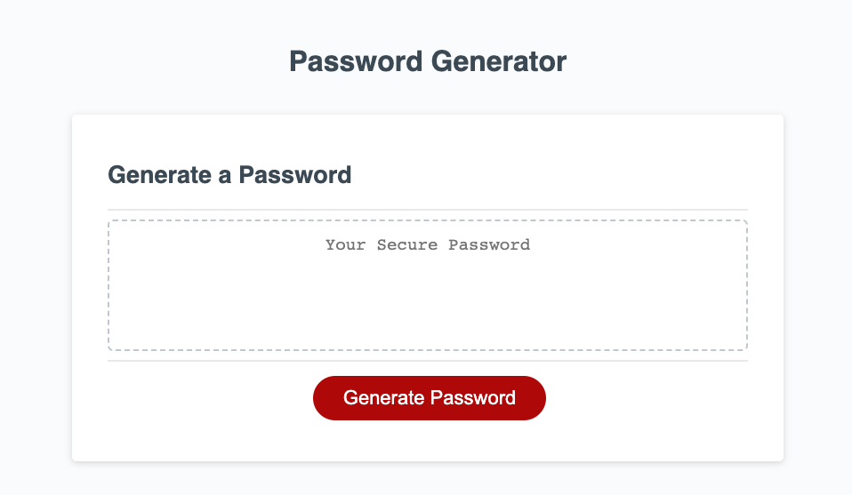

#JavaScript: Password Generator

## Description

A password generator app that uses the web browser's windows to collect user inputs and outputs a password. This password generator can generate a password and the user can choose to include lowercase, uppercase, numeric and/or special characters. When the password is generated it is written to the page.

## Usage

This application is deployed to a URL and can be accessed using an internet browser. Clicking the generate button will display browser windows in a sequence to collect information from the user. When the user has inputted the required information the password is written to the webpage.

## Credits

## License
Please refer to the LICENSE in the repo